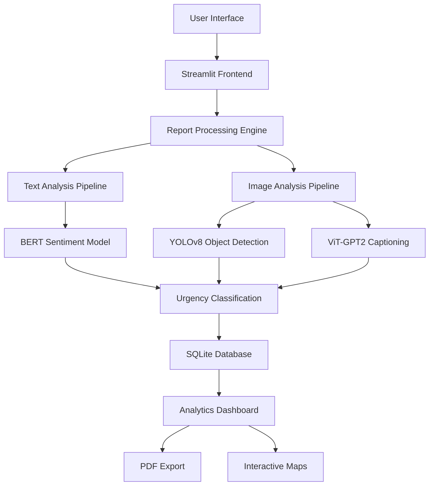

# 🛡️ usalama_jijini - Nairobi Crime Reporting AI System

🔗 [View Interactive Gamma Presentation](https://gamma.app/docs/Usalama-Jijini-Smart-Crime-Reporting-App-yxbejhjsuqmh25z)


> **"usalama_jijini"** (Swahili for "Safety of the People") - An AI-powered crime reporting and analysis system designed to enhance public safety in Nairobi County through intelligent incident reporting, real-time sentiment analysis, and automated threat assessment.

🎥 [▶️ Watch the Usalama Jijini Demo](https://victor-busami.github.io/usalama_jijini/)


---

## 📋 Table of Contents

- [🚀 Overview](#-overview)
- [✨ Key Features](#-key-features)
- [🤖 AI Technologies](#-ai-technologies)
- [🏗️ System Architecture](#️-system-architecture)
- [📊 Dashboard Features](#-dashboard-features)
- [🛠️ Installation & Setup](#️-installation--setup)
- [🔧 Usage Guide](#-usage-guide)
- [📱 User Interface](#-user-interface)
- [🔒 Security & Authentication](#-security--authentication)
- [📈 Analytics & Reporting](#-analytics--reporting)
- [🌍 Deployment](#-deployment)
- [👥 Team Collaboration Guide](#-team-collaboration-guide)
- [🤝 Contributing](#-contributing)
- [📄 License](#-license)

---

## 🚀 Overview

**usalama_jijini** is a cutting-edge AI-powered crime reporting system specifically designed for Nairobi County. This comprehensive platform combines multiple machine learning technologies to provide intelligent crime incident analysis, automated threat assessment, and real-time safety monitoring.

### 🎯 Mission Statement

To leverage artificial intelligence and modern web technologies to create a safer Nairobi by enabling citizens to report incidents efficiently while providing law enforcement with intelligent insights for better resource allocation and response prioritization.

### 🌟 Why This Project Matters

- **Real-time Crime Intelligence**: Instant analysis of reported incidents using advanced AI
- **Community Empowerment**: Easy-to-use interface for citizens to report safety concerns
- **Data-Driven Policing**: Actionable insights for law enforcement agencies
- **Multilingual Support**: Built with Kenya's linguistic diversity in mind
- **Mobile-First Design**: Accessible on all devices for maximum reach

---

## ✨ Key Features

### 🔍 **Intelligent Crime Analysis**

- **Multi-Modal AI Processing**: Analyzes both text descriptions and uploaded images
- **Real-time Sentiment Analysis**: Uses BERT-based multilingual models to assess incident severity
- **Object Detection**: YOLOv8-powered image analysis to identify weapons, vehicles, and other relevant objects
- **Automated Threat Assessment**: Combines text and image analysis for comprehensive risk evaluation

### 📊 **Advanced Reporting System**

- **Interactive Crime Reports**: Structured incident reporting with location mapping
- **Priority-Based Urgency Classification**: Automatic categorization (High 🚨 / Medium 🟡 / Low ✅)
- **Multi-Source Data Integration**: Text descriptions + Image evidence + Location data
- **Contact Information Management**: Secure handling of reporter contact details

### 🗺️ **Geographic Intelligence**

- **Interactive Maps**: Folium-powered visualization of crime incidents across Nairobi
- **Sub-County Filtering**: Detailed breakdown by Nairobi's administrative areas
- **Heat Map Analysis**: Visual representation of crime concentration areas
- **Location-Based Alerts**: Geographic threat assessment capabilities

### 📈 **Analytics Dashboard**

- **Real-time Statistics**: Live crime reporting metrics and trends
- **Sentiment Distribution**: Analysis of incident severity patterns
- **Location-Based Insights**: Sub-county crime statistics and comparisons
- **Export Capabilities**: PDF report generation for official documentation

---

## 🤖 AI Technologies

### 🧠 **Natural Language Processing**

```python
# Multilingual Sentiment Analysis
Model: "nlptown/bert-base-multilingual-uncased-sentiment"
Capability: 5-star rating sentiment classification
Languages: Multiple (optimized for English and Swahili contexts)
```

### 👁️ **Computer Vision**

```python
# Object Detection
Model: YOLOv8n (Ultralytics)
Objects: 80+ classes including weapons, vehicles, people
Performance: Real-time inference on CPU/GPU

# Image Captioning
Model: "nlpconnect/vit-gpt2-image-captioning"
Architecture: Vision Transformer + GPT-2
Purpose: Automatic scene description for sentiment analysis
```

### 🔗 **Multi-Modal Fusion**

- **Combined Analysis**: Merges text sentiment with image-derived insights
- **Hierarchical Urgency**: Intelligent priority assignment based on multiple data sources
- **Context-Aware Processing**: Considers cultural and linguistic context for Nairobi

---

## 🏗️ System Architecture



### 💾 **Data Flow**

1. **Input Layer**: User submits incident report (text + optional image)
2. **AI Processing**: Parallel processing through NLP and Computer Vision pipelines
3. **Analysis Fusion**: Combines text sentiment with image-derived insights
4. **Classification**: Automatic urgency and threat level assignment
5. **Storage**: Secure database storage with SQLite
6. **Visualization**: Real-time dashboard updates and geographic mapping

---

## 📊 Dashboard Features

### 🔐 **Admin Dashboard**

- **Comprehensive Report Management**: View, filter, and analyze all incident reports
- **Multi-Dimensional Filtering**: By location, urgency, sentiment, and time
- **Export Functionality**: Generate PDF reports for official use

### 📍 **Interactive Mapping**

- **Real-time Incident Plotting**: Live updates on Nairobi crime map
- **Color-Coded Markers**: Visual urgency indicators (Red/Orange/Green)
- **Detailed Popups**: Complete incident information on map interaction
- **Sub-County Analysis**: Drill-down capabilities for specific areas

### 📈 **Analytics Features**

- **Total Reports Counter**: Real-time incident tracking
- **High Urgency Alerts**: Priority incident highlighting
- **Location Statistics**: Unique area analysis
- **Sentiment Trends**: Negative incident pattern recognition

---

## 🛠️ Installation & Setup

### 📋 **Prerequisites**

- Python 3.8+
- 4GB+ RAM (for AI model loading)
- 2GB+ free disk space
- Internet connection (for initial model downloads)

### ⚙️ **Installation Steps**

1. **Clone the Repository**

```bash
git clone https://github.com/victor-busami/usalama_jijini.git
cd usalama_jijini
```

2. **Create Virtual Environment**

```bash
python -m venv venv
# Windows
venv\Scripts\activate
# macOS/Linux
source venv/bin/activate
```

3. **Install Dependencies**

```bash
pip install -r requirements.txt
```

4. **Download AI Models**

```bash
# YOLOv8 model will auto-download on first run
# Transformers models will auto-download on first use
```

5. **Run the Application**

```bash
streamlit run app.py
```

### 🌐 **Access the Application**

- **Local URL**: `http://localhost:8501`
- **Network URL**: `http://[your-ip]:8501`

---

## 🔧 Usage Guide

### 👤 **For Citizens (Report Submission)**

1. **Navigate to "Report Crime"** in the sidebar
2. **Fill out the incident form**:
   - **Description**: Detailed incident narrative
   - **Image Upload**: Optional evidence photos
   - **Location**: Select from Nairobi sub-counties
   - **Contact Info**: Optional contact details
3. **Submit Report**: System automatically analyzes and categorizes
4. **Confirmation**: Receive submission confirmation with toast notification

### 👮 **For Administrators (Report Management)**

1. **Login** with admin credentials:
   - **Username**: `admin`
   - **Password**: `Admin!2024Secure`
2. **Access "View Reports"** dashboard
3. **Analyze Data**:
   - Review all submitted reports
   - Use filtering options for specific analysis
   - View interactive crime map
   - Export reports as PDF
4. **Take Action**: Use insights for resource allocation and response

---

## 📱 User Interface

### 🎨 **Design Philosophy**

- **Clean & Intuitive**: Streamlit-powered modern interface
- **Mobile-Responsive**: Works seamlessly on all devices
- **Accessibility-First**: Clear navigation and visual indicators
- **Cultural Sensitivity**: Designed for Nairobi's diverse population

### 🔄 **User Experience Flow**

```
Landing Page → Report Selection → Form Filling → AI Analysis → Confirmation
     ↓
Admin Login → Dashboard Access → Report Analysis → Action Planning
```

### 🎯 **Visual Elements**

- **Urgency Indicators**: Color-coded priority levels (🚨🟡✅)
- **Interactive Cards**: Expandable report summaries
- **Real-time Updates**: Live dashboard refresh
- **Geographic Visualization**: Interactive Folium maps

---

## 🔒 Security & Authentication

### 🛡️ **Security Features**

- **Admin Authentication**: Secure login system for report access
- **Session Management**: Streamlit session state handling
- **Data Encryption**: Secure database storage
- **Input Validation**: Comprehensive form validation
- **Access Control**: Role-based permissions

### 🔐 **Privacy Protection**

- **Optional Contact Info**: Citizens can report anonymously
- **Data Minimization**: Only necessary information collected
- **Secure Storage**: SQLite database with proper access controls
- **No External Data Sharing**: All processing done locally

---

## 📈 Analytics & Reporting

### 📊 **Key Metrics**

- **Total Incident Reports**: Real-time counter
- **High Priority Cases**: Urgent incident tracking
- **Geographic Distribution**: Location-based analysis
- **Sentiment Analysis**: Negative incident patterns
- **Response Efficiency**: Time-based performance metrics

### 📋 **Report Export Features**

- **PDF Generation**: Professional report formatting using ReportLab
- **Filtered Exports**: Custom report generation based on selected criteria
- **Visual Elements**: Charts and graphs included in exports
- **Official Documentation**: Suitable for law enforcement use

---

## 🌍 Deployment

### ☁️ **Cloud Deployment Options**

#### **Streamlit Cloud** (Recommended)

```bash
# Connect GitHub repository to Streamlit Cloud
# Automatic deployment on push to main branch
# Free tier available with limitations
```

#### **Render.com**

```yaml
# render.yaml configuration included
services:
  - type: web
    name: usalama-wa-watu
    env: python
    buildCommand: pip install -r requirements.txt
    startCommand: streamlit run app.py --server.port $PORT
```

#### **Heroku**

```bash
# Procfile configuration
web: streamlit run app.py --server.port=$PORT --server.address=0.0.0.0
```

### 🐳 **Docker Deployment**

```dockerfile
FROM python:3.9-slim
WORKDIR /app
COPY requirements.txt .
RUN pip install -r requirements.txt
COPY . .
EXPOSE 8501
CMD ["streamlit", "run", "app.py"]
```

---

## 👥 Team Collaboration Guide

**usalama_jijini** is a collaborative software project built by a team of five developers to improve community safety and incident reporting through technology.

### 🚀 **Project Overview**

This project is in active development by a team of contributors working in parallel on separate branches to ensure smooth development and integration.

### 🔧 **Branch Setup & Workflow**

Each developer must follow these steps:

#### 1. **Clone the repository and create a branch**

```bash
git clone https://github.com/victor-busami/usalama_jijini.git
cd usalama_jijini
git checkout -b your-branch-name
git push -u origin your-branch-name
```

#### 2. **Make changes and push**

```bash
# Make your changes
git add .
git commit -m "Descriptive message"
git push
```

#### 3. **Create a Pull Request (PR)**

1. Go to the GitHub repository on the web
2. Click "Compare & pull request"
3. Add a clear title and description
4. Assign a reviewer
5. Wait for approval before merging

### 🛡️ **Branch Protection Rules**

The `main` branch is protected with the following rules:

- ✅ **No direct pushes allowed**
- ✅ **Pull requests required**
- ✅ **At least 1 review required to merge**
- ✅ **Branch must be up to date with `main`**
- ✅ **Admins must follow the same rules**

---

## 🤝 Contributing

### 🌟 **We Welcome Contributions!**

Whether you're fixing bugs, adding features, improving documentation, or suggesting enhancements, your contributions are valuable to making Nairobi safer.

### 📝 **Contribution Guidelines**

1. **Fork the Repository**
2. **Create a Feature Branch** (`git checkout -b feature/amazing-feature`)
3. **Make Your Changes**
4. **Add Tests** (if applicable)
5. **Commit Changes** (`git commit -m 'Add amazing feature'`)
6. **Push to Branch** (`git push origin feature/amazing-feature`)
7. **Open a Pull Request**

### 🐛 **Bug Reports**

- Use GitHub Issues to report bugs
- Include detailed reproduction steps
- Provide system information and screenshots

### 💡 **Feature Requests**

- Open a GitHub Issue with the "enhancement" label
- Describe the feature and its potential impact
- Discuss implementation approach

---

## 📄 License

This project is licensed under the **MIT License** - see the [LICENSE](LICENSE) file for details.

### 📜 **License Summary**

- ✅ Commercial use allowed
- ✅ Modification allowed
- ✅ Distribution allowed
- ✅ Private use allowed
- ❌ Liability protection
- ❌ Warranty protection

---

## 🙏 Acknowledgments

### 🏆 **Special Thanks**

- **Nairobi County Government** for supporting community safety initiatives
- **Hugging Face** for providing state-of-the-art AI models
- **Ultralytics** for the YOLOv8 object detection framework
- **Streamlit** for the amazing web framework
- **OpenStreetMap Contributors** for mapping data

### 🎓 **Research & Development**

This project incorporates research from:

- Computer Vision for Public Safety
- Multilingual NLP for African Languages
- Community-Driven Crime Prevention
- Human-AI Collaboration in Emergency Response

---

## 📞 Contact & Support

### 👨‍💻 **Development Team**

- **Lead Developer**: Victor Busami
- **GitHub**: [@victor-busami](https://github.com/victor-busami)
- **Project Repository**: [usalama-wa-watu-final](https://github.com/victor-busami/usalama-wa-watu-final)

**Contributors**:
- [@Kendi7](https://github.com/Kendi7)
- [@kamene22](https://github.com/kamene22)
- [@BlessedConso001](https://github.com/BlessedConso001)
- [@FinaAkinyi](https://github.com/FinaAkinyi)
- [@victor-busami](https://github.com/victor-busami)

### 🆘 **Support**

- **Issues**: [GitHub Issues](https://github.com/victor-busami/usalama-wa-watu-final/issues)
- **Discussions**: [GitHub Discussions](https://github.com/victor-busami/usalama-wa-watu-final/discussions)
- **Email**: [Create an issue for direct contact]

---

## 🚀 **Happy Collaborating! 💻🚀**

_Together, we're building a safer Nairobi through technology and community collaboration._

---

<div align="center">

**Made with ❤️ in Nairobi, Kenya**


</div>
